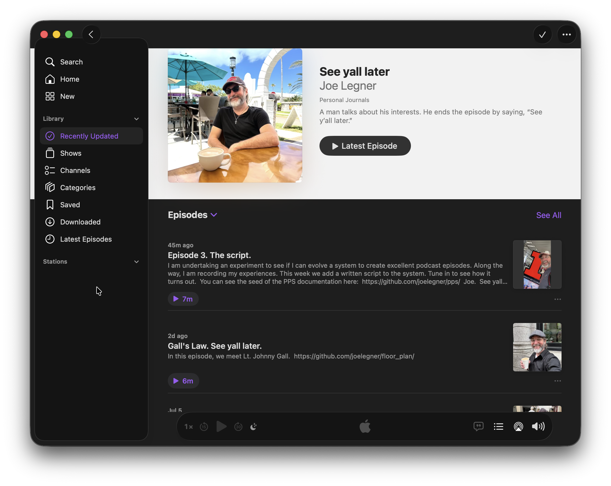

# Podcast Production System documentation.

_When did I write this?_

Saturday, July 18, 2026.

_What is this all about?_

I have a podcast. I want to document it.

_Where can I listen to this podcast?_

https://podcasts.apple.com/us/podcast/see-yall-later/id6791297832

_What is the "podcast production system"?_

The podcast production system is what I use to produce my podcast, "See yall later".

_What does the PPS depend on that is outside the PPS?_

1. `RSS.com` website.
2. `podcastsconnect.apple.com` website.
3. Apple Podcasts app.
4. Apple Podcasts subscription.
5. The practitioner, me, Joe Legner.

_What is the current set of components in the PPS?_

1. iPhone 13 hardware component.
2. Mac Mini hardware component.
3. Shure Beta 58A microphone hardware component.
4. Focusrite Scarlet 2i2 audio interface hardware component.
5. Microphone cable hardware component.
6. Headphones hardware component.
7. Garage Band software component.
8. Audacity software component. 
9. Authenticator App to log into Github to maintain the repository.
10. Apple Podcasts subscription software component. 
11. Apple Podcasts subscription policy.
12. Piano interlude policy.
13. Written script policy.
14. Rule of 3 adoption policy.
15. Documentation on Github policy.
16. Four-inch distance from mouth to microphone policy.
17. Turn off the fan before recording policy.
18. Do not under-utilize nor over-utilize policies policy.
19. Policies are posted in this `README.md` file on Github policy. 
20. Fountain script format policy. 

_What makes up the podcast production system?_

The PPS is a set of software components, hardware components, policies, and one human practitioner. 

_What led to the existence of the podcast production system?_

I needed a way to produce one podcast episode, all the way from conception to publishing.

_Why does this Github repository exist?_

It documents the PPS for better performance.

_What constitutes better performance?_

Better podcast episodes. 

_What makes a podcast episode better?_

1. More useful.
2. More entertaining.
3. Clearer.
4. More understandable. 
5. Communicates wisdom. 

I wanted to document the experiment I started.

_What is the experiment?_

1. Make a working system that produces podcast episodes.
2. Improve the system between episodes.
3. Document the system along the way.
4. See what happens.

_What is a "component"?_

A component is a part that can be talked about as a single unit, not made up of smaller parts.

_What is a "podcast season"?_

A season is a set of related espisodes.

_Why are some words put into quotation marks?_

Those are "terms" in the PPS. 

_What is the definition of "term"?_

A term is a specified word used in exactly one of its word senses.

_What seasons are we in?_

The podcast is in season 1. 

_What is an episode?_

An episode is a set of three parts.

_What is a part?_

1. The part is the major division of an episode.
2. The three standard episode parts are: "setup", "do", and "cleanup". 

_What is a segment?_

A segment is part of a part. 

_How does the "rule of 3" apply?_

An episode is three (3) parts and the middle "do" part is three (3) segments. 

_What is a series?_

A series is a set of seasons.

_Where is the documentation posted?_

https://github.com/joelegner/pps/

_What is in the outlines directory?_

Freeplane mind maps.

_What is Freeplane?_

Freeplane is an open-sourced mind mapping software which forked from a predecessor called Freemind.

_Where can I find out more about Freeplane?_

https://docs.freeplane.org

## Glossary Candidate 1

Extrinsic content:
: Podcast episode content from outside the podcast production system.

Intrinsic content:
: Podcast episode content from inside the podcast production system.

Podcast content:
: Content offered in part 2 of the standard three-part episode structure.

## Glossary Candidate 2

<dl>
<dt>Extrinsic content</dt>
<dd>Podcast episode content from outside the podcast production system.</dd>

<dt>Intrinsic content</dt>
<dd>Podcast episode content from inside the podcast production system.</dd>

<dt>Podcast content</dt>
<dd>Content offered in part 2 of the standard three-part episode structure.</dd>
</dl>

## Glossary Candidate 3

| Term | Definition |
|---|---|
| Extrinsic content | Podcast episode content from outside the podcast production system. |
| Intrinsic content | Podcast episode content from inside the podcast production system. |
| Podcast content | Content offered in part 2 of the standard three-part episode structure. |

## Glossary Candidate 4

**Extrinsic content**
Podcast episode content from outside the podcast production system.

**Intrinsic content**
Podcast episode content from inside the podcast production system.

**Podcast content**
Content offered in part 2 of the standard three-part episode structure.
